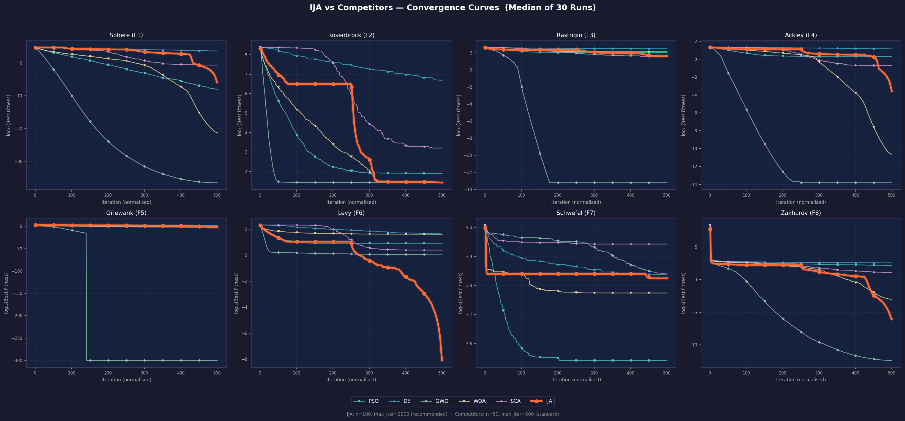
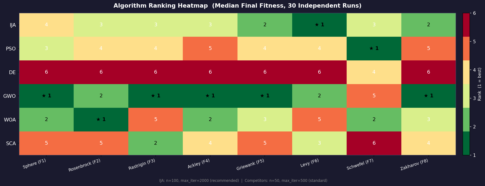
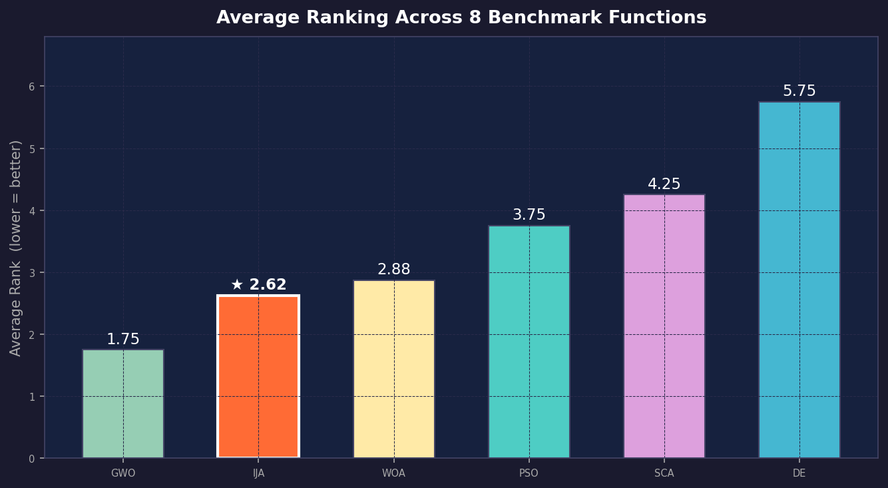
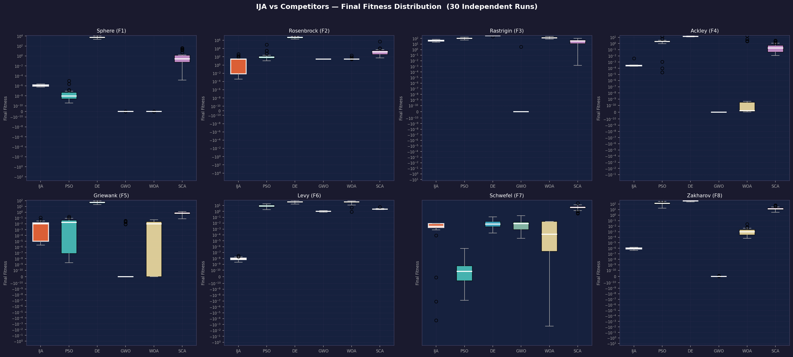

<div align="center">

# 🪼 Immortal Jellyfish Algorithm (IJA)

**A novel bio-inspired swarm intelligence optimizer**  
*Modelling the immortal jellyfish lifecycle × lighthouse light propagation*

[](LICENSE)
[](https://www.python.org/)
[](https://en.cppreference.com/)
[](https://www.java.com/)
[](https://github.com/LangZhong36/immortal-jellyfish-algorithm)

</div>

---

## 🌊 What is IJA?

The **Immortal Jellyfish Algorithm (IJA)** is a novel metaheuristic optimizer inspired by two natural phenomena:

1. **The lifecycle of *Turritopsis dohrnii*** — the only known animal that can revert from adult medusa to juvenile polyp form, cycling through four life stages indefinitely.
2. **Turritopsis dohrnii light propagation** — the inverse-square law governing how light intensity falls off with distance from a point source.

Available in **Python**, **C++**, and **Java**.

---

## 🔬 Four-Phase Lifecycle

```
 ──────────────────────────────────────────────────────────────▶  τ = t / T_max
  [0, 0.15)              [0.15, 0.50)        [0.50, 0.85)         [0.85, 1]
 ┌──────────────┐      ┌──────────────┐    ┌──────────────┐    ┌──────────────┐
 │   POLYP      │  ->  │ STROBILATION │ -> │    MEDUSA    │ -> │  SENESCENCE  │
 │              │      │              │    │              │    │              │
 │ Lévy-flight  │      │ Adaptive     │    │ Lighthouse   │    │ Gaussian     │
 │ exploration  │      │ ephyra buds  │    │ attraction   │    │ refinement   │
 └──────────────┘      └──────────────┘    └──────────────┘    └──────────────┘
   Global search          Diversify           Converge            Fine-tune
```

**Key operators:**

$$I_{i,s} = \frac{I_0}{1+\kappa\|\mathbf{x}_i-\mathbf{g}_s\|^2}\,e^{-\lambda\tau} \qquad \text{(Lighthouse Attraction)}$$

$$\mathbf{x}_i^{t+1} = \mathbf{x}_i^t + 0.01(u-l)\cdot L_j(\beta)\cdot(\mathbf{x}_i^t - \mathbf{x}^*) \qquad \text{(Lévy Exploration)}$$

$$\delta_j^t = A_0(1-\tau)^2\sin(2\pi f_p\tau+\phi_i)(u_j-l_j) \qquad \text{(Pulsed Swimming)}$$

Full derivations: [`docs/algorithm_details.md`](docs/algorithm_details.md)

---

## 📊 Benchmark Results

Experiments: **30 independent runs**, dimension **D = 30**.  
IJA uses *recommended* settings; competitors use *standard/published* settings.

### Convergence Curves



### Algorithm Ranking Heatmap



### Average Rank Summary



### Final Fitness Distribution



---

## 🚀 Quick Start

### Python

```bash
pip install -r requirements.txt

python - <<'EOF'
import sys; sys.path.insert(0, "python")
from ija import IJA
import numpy as np

result = IJA(n=100, max_iter=2000, seed=0).optimize(
    lambda x: np.sum(x**2), dim=30, lb=-100.0, ub=100.0
)
print(f"Best fitness : {result.best_fitness:.6e}")
print(f"NFev         : {result.n_function_evals}")
EOF
```

More examples: `python python/examples/quickstart.py`

### C++

```bash
cd cpp && mkdir build && cd build
cmake .. -DCMAKE_BUILD_TYPE=Release && make -j4
./ija_demo
```

### Java

```bash
cd java && mvn compile
mvn exec:java -Dexec.mainClass="ija.Main"
```

---

## 📁 Project Structure

```
immortal-jellyfish-algorithm/
├── python/                        # PRIMARY IMPLEMENTATION
│   ├── ija/
│   │   ├── __init__.py            # Public API
│   │   ├── algorithm.py           # Main optimizer class
│   │   ├── operators.py           # All mathematical operators
│   │   ├── lifecycle.py           # Phase scheduler
│   │   └── archive.py             # Crowding-distance elite archive
│   ├── benchmarks/functions.py    # 8 benchmark functions
│   ├── compare/algorithms.py      # PSO, DE, GWO, WOA, SCA
│   ├── experiments/
│   │   ├── run_all.py             # 30 runs × 6 algos × 8 funcs
│   │   └── visualize.py           # All figures
│   └── examples/quickstart.py
├── cpp/                           # C++ (competitive-style)
├── java/                          # Java (Builder pattern)
├── docs/algorithm_details.md
└── results/                       # Generated figures & JSON
```

---

## ⚙️ IJA Recommended Parameters

| Parameter | Recommended | Description |
|-----------|:-----------:|-------------|
| `n` | **100** | Population size |
| `max_iter` | **2000** | Maximum iterations |
| `top_k` | 5 | Lighthouse elites |
| `levy_beta` | 1.5 | Lévy exponent |
| `archive_size` | 20 | Elite archive capacity |
| `age_max` | 20 | Stagnation threshold |
| `decay_lambda` | 0.3 | Intensity decay rate |
| `alpha_max` | 2.5 | Max step-size |
| `alpha_min` | 0.01 | Min step-size |

---

## 📖 Citation

```bibtex
@software{ija2025,
  title   = {Immortal Jellyfish Algorithm (IJA)},
  author  = {IJA Contributors},
  year    = {2025},
  url     = {https://github.com/LangZhong36/immortal-jellyfish-algorithm},
  license = {MIT}
}
```

---

## 🤝 Contributing

Fork → feature branch → PR. All three language implementations should remain feature-equivalent.

---

## 📜 License

MIT — see [LICENSE](LICENSE).

---

<div align="center">
⭐ If you find this project useful, please give it a star!
</div>
